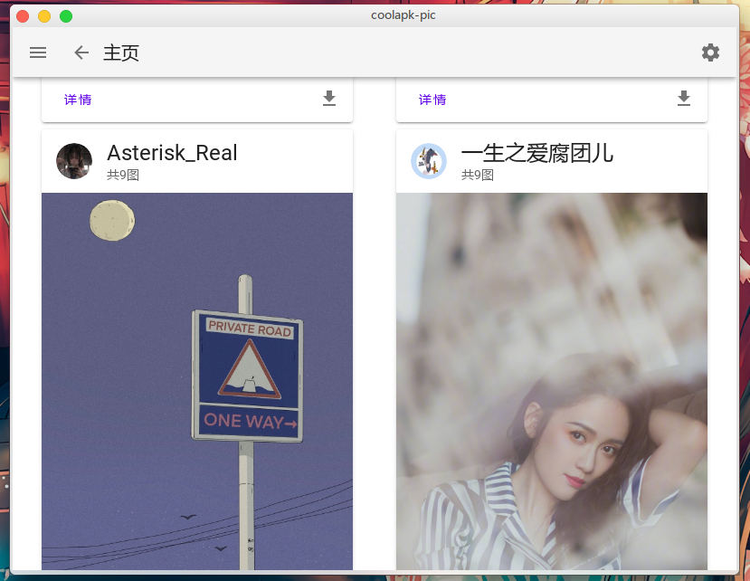
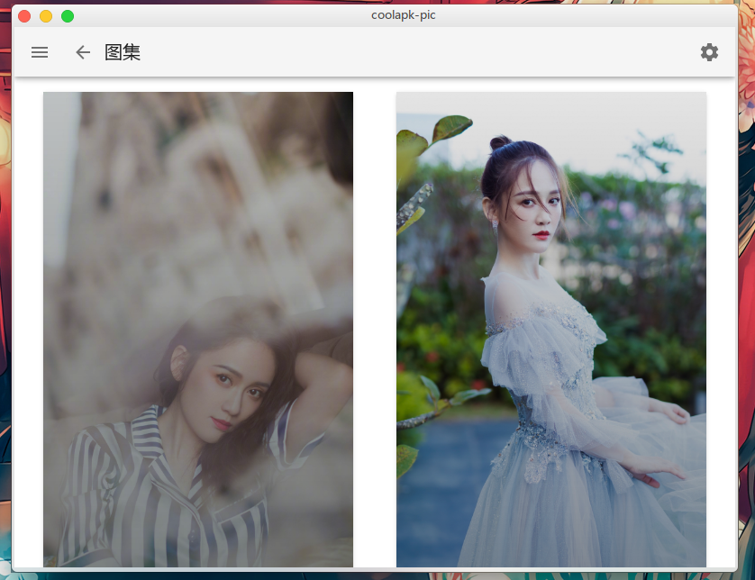
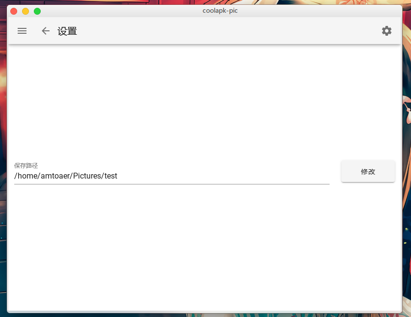

<p align="center">
    </img>
</p>

<h1 align="center">
    酷安酷图客户端
</h1>
<p align="center">
    </img>
	</img>
	</img>
</p>

## 介绍
> 注：本人也正处于学习阶段，可能没有足够的能力扩展功能、修复bug，但我会尽力的！XD

该项目为酷安酷图桌面客户端，使用`vue`+`electron`开发。目前功能有：

+ 主页浏览（**暂不支持分类、标签**）
+ 图集图片批量下载
+ 图集内图片预览
+ 单张下载
+ 自定义保存路径

欢迎大家反馈问题，提出建议。

## 安装

1. 手动安装

   + 克隆项目

     ```bash
     git clone https://github.com/amtoaer/coolapk-pic-v2
     cd coolapk-pic-v2
     ```

   + 安装依赖

     ```bash
     yarn
     ```

   + 手动构建

     ```bash
     yarn electron:build
     ```

2. 在[该页面](https://github.com/amtoaer/coolapk-pic-v2/releases/)安装你所使用系统的预构建包

   + `windows`

     下载`coolapk-pic.Setup.version.exe`，双击安装并运行。

   + `macOS`

     没有用过，只是打了包，欢迎测试。

   + `archlinux/manjaro`

     下载`coolapk-pic-version.pacman`，通过以下命令进行安装：

     ```bash
     sudo pacman -U /path/to/coolapk-pic-version.pacman
     ```

   + `other linux distros`

     下载`coolapk-pic-version.AppImage`，给予可执行权限并运行：

     ```bash
     sudo chmod +x /path/to/coolapk-pic-version.AppImage
     /path/to/coolapk-pic-version.AppImage
     ```

## 截图

1. 主页（点击`详情`进入详情页，点击`下载`进行图集批量下载）

   

2. 详情（点击单张图片任意位置即可开始下载）

   

3. 设置（保存路径默认为用户文件夹）

   

## 感谢

+ `vue-cli`
+ `vue-cli-plugin-electron-builder`
+ `vuetify`

